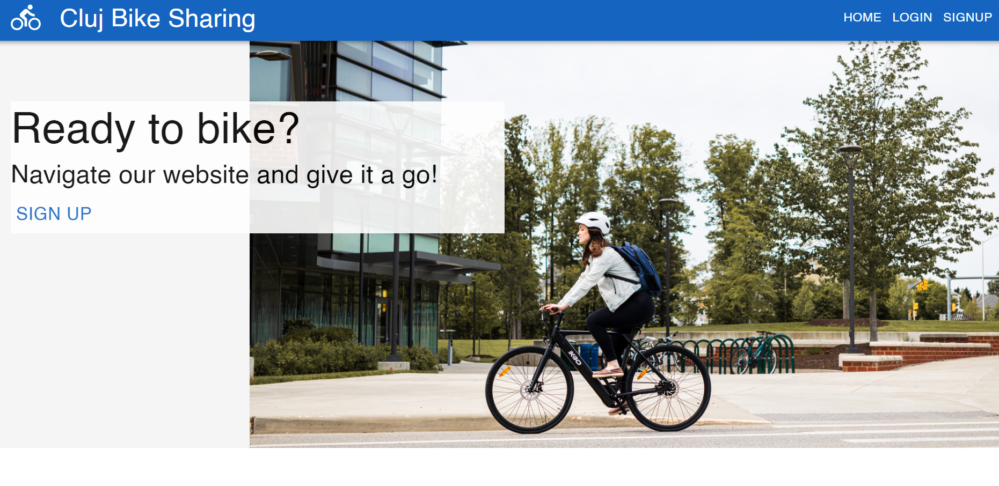
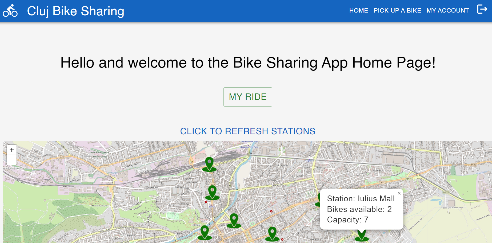
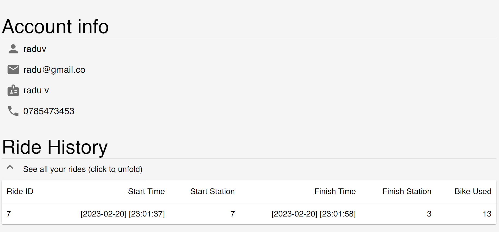
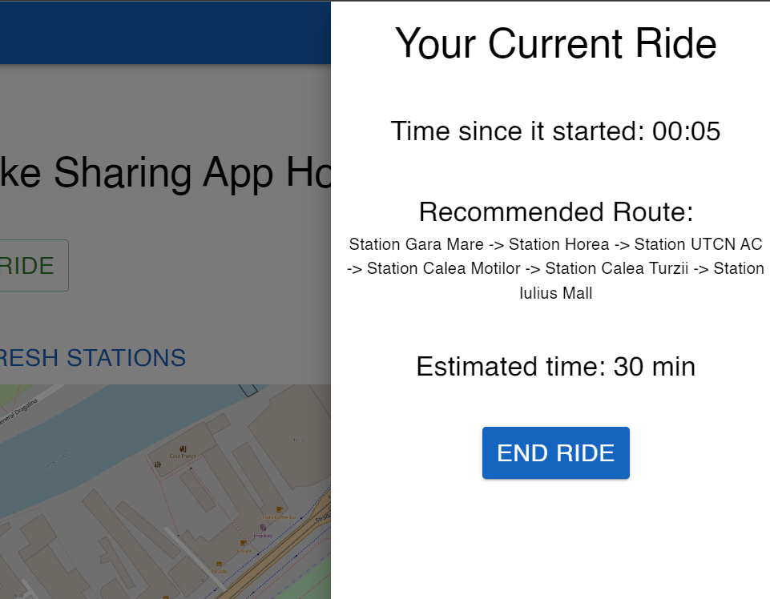

# Bike Sharing Web App 🚲

> A web application for managing a bike-sharing system. The system involves only the self-reported user activity (no background check for any actual physical bikes).

Contributors: 
* [Kiss Borbála](https://github.com/KissBorbala/) 
* [Păun Andreea-Oana](https://github.com/AndreeaPaun12) 
* [Vele Radu-Augustin](https://github.com/Radu-Vele)

## Tech stack 
- 
- 
- 

## Project status
- the project is currently `under development` 🚈.

## GUI Screenshots
See below some screenshots from the app.
### Home page (users not logged in)

### Home page (logged in user)

### Account info page

### Current Ride

## How to run the project
The project is version controlled using a wrapper repository (the one that contains this README file) over two modules (one for the frontend and one from the backend).
- after cloning the [wrapper repository](https://github.com/Radu-Vele/Bike_Sharing_System) run the following commands to clone the modules for the frontend and backend:
    - `git submodule init`
    - `git submodule update`
- make sure you are on the `main` branch in each repo.

### MySQL DataBase
- one needs to setup a local database schema using MySQL and edit the username and password in `src/main/resources/application.properties`. This can be done directly from IntelliJ [see documentation](jetbrains.com/help/idea/mysql.html).
- currently, the app does not offer a server side so the database can only be populated using Postman and the requests defined in the controller package in the backend.

### Backend using IntelliJ
The steps are described below:
- import project from existing sources (select the backend folder)
- setup the SDK (Java 17 is recommended)
- setup maven: in Maven Settings/ set the maven home path to Bundled (Maven 3)
- make sure all dependencies are resolved and run the `@SpringBootApplication` from `SeProjectBackendApplication.java`.

### Frontend using VSCode
- open a terminal in the project directory and run the commands `npm install` and `npm start`.
- make sure to open the `localhost:3000` in incognito mode (Google Chrome is used during development) with CORS enabled.

## Credits
- the organization of the project packages and modules was inspired by [Purshink Full Stack App Repository](https://github.com/purshink/ReactJS-Spring-Boot-Full-Stack-App.git)